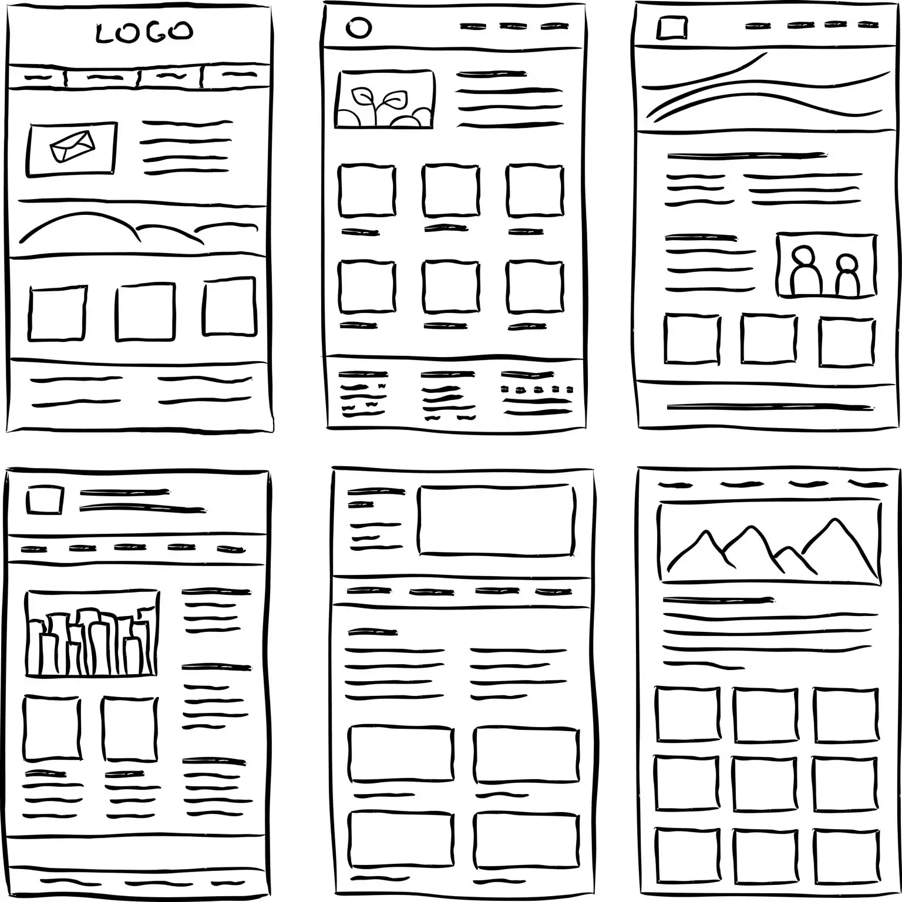

# TP1 : Maquette fil de fer

Énoncé : cours 4 \
Remise : cours 7 \
Pondération : 15%

Les trois travaux pratiques (TP) pour ce cours s'organisent autour d'un projet Web sur lequel vous travaillerez au fil de la session. Le but est de simuler des conditions réelles de production tout en me permettant d'évaluer votre maîtrise des compétences requises à chaque étape du design et de la création d'une interface Web.

Pour ce faire, vous devrez créer un site Web qui répond au cahier des charges réalisé précédemment.

## Consignes

Pour le premier travail pratique, vous commencerez par réaliser des maquettes fil de fer à l'aide de l'éditeur de graphiques vectoriels Figma. Vous devrez concevoir **3 différentes versions** des pages suivantes : 

- Page d'accueil
- Page propre au modèle de site Web choisi — page « produit » pour un site marchand, page « article » pour un site informatif, page « projet » pour un portfolio, et ainsi de suite.

Vos maquettes doivent aussi inclure des **notes** qui expliquent le **raisonnement** derrière vos choix, ainsi que la **relation** entre l'interface choisie et la ou les fonctionnalités de la page. Attention, ça ne devrait pas être une description de ce que vous avez fait (je suis capable de voir), mais plutôt une **justification**. Attention également aux fausses-évidences et à l'ethnocentrisme.

## Éléments livrables

- Un seul document PDF incluant vos maquettes fil de fer et les annotations.

## Présentation

Lors de la remise, vous devrez également présenter vos maquettes à un groupe de vos pairs. Vous aurez 15 minutes pour : 

1. Résumer le cahier des charges auquel vous répondez ;
2. Et expliquer le raisonnement derrière vos choix. 

Gardez votre présentation informelle. L'étape de la maquette fil de fer est un temps pour faire des essais, et surtout, pour se tromper. Après votre présentation, une période sera allouée aux questions et aux commentaires.

## Critères d'évaluation

### Respect des consignes `2`

- Voir ci-haut.

### Qualité des maquettes `3`

- Les maquettes sont réalisées avec soins.
- Le niveau de fidélité des maquettes est suffisamment bas pour permettre une itération rapide.
- Les interfaces proposées sont suffisamment variées.

### Profondeur de la réflexion `10`

- Le raisonnement derrière les choix est justifié en se référant au cahier des charges, aux bonnes pratiques de l'expérience utilisateur·rice, aux fonctionnalités mises de l'avant, au parcours des utilisateur·rices, etc.
- Le vocabulaire utilisé est précis et adéquat (utilisez un glossaire au besoin).